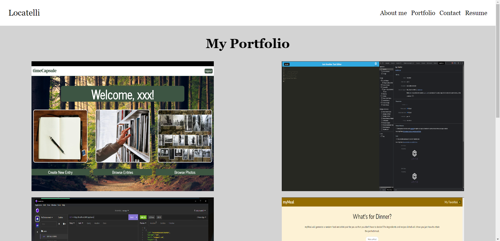

# my-react-portfolio

  
  
  ## Table of Contents
  * [Description](#description)
  * [Installations](#installation)
  * [Usage](#usage)
  * [License](#license)
  * [Contributing](#contributing)
  * [Tests](#tests)
  * [Questions](#questions)

  ## Description
  This is my portfolio to display the recent work i have created.
  

  ## Installation
  Just need to go to https://github.com/b-locatelli/my-react-portfolio and run npm start on the application.

  ## Usage
  Run npm i and npm start and start learning about me. 

  ## Licenses
    Your application is covered under MIT

  ## Questions
  * Github: https://github.com/baily-locatelli
  * Email: bailylocatelli@gmail.com
  github pages: https://b-locatelli.github.io/my-react-portfolio/